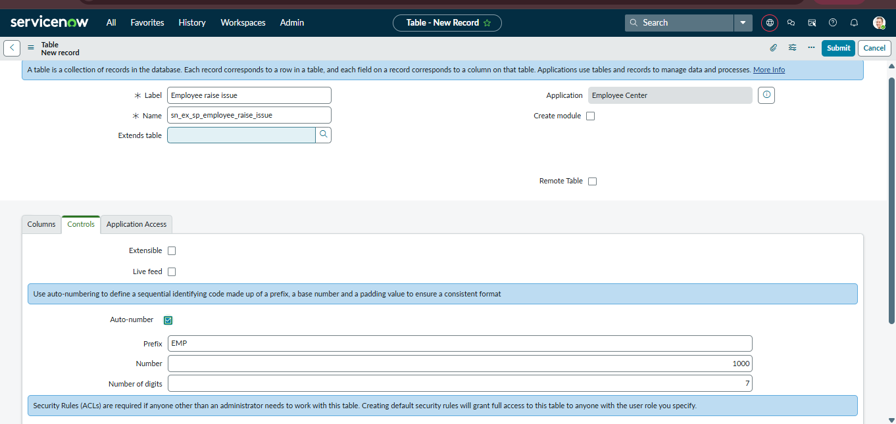
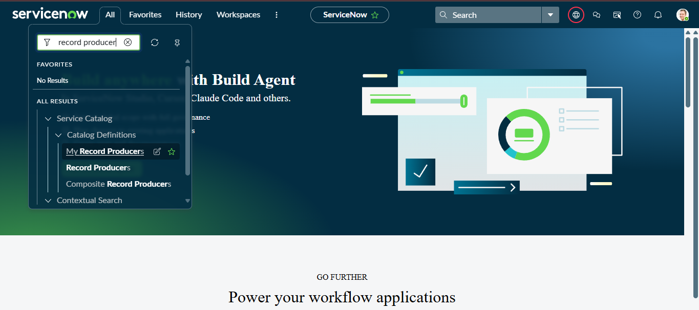
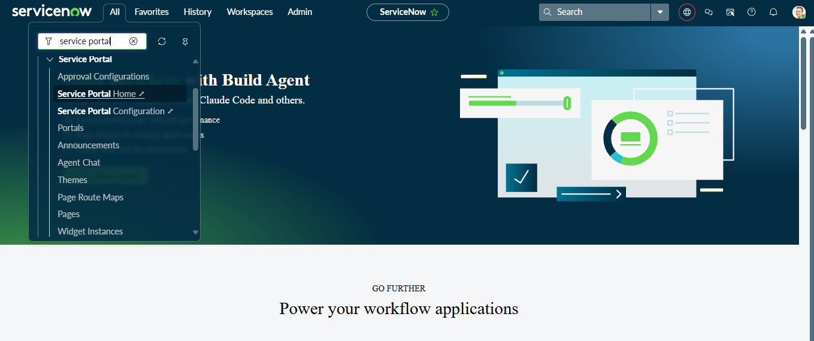
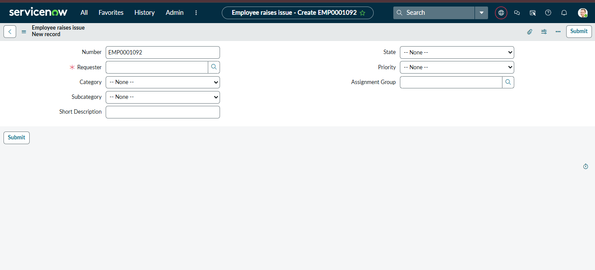
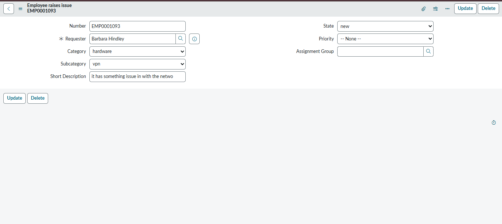

# Employee Raise Issue – ServiceNow

## Project Overview

Employee Raise Issue is a ServiceNow application designed to provide employees with a simple and centralized way to raise workplace-related issues through a Service Portal.

The application allows employees to submit their issues using a user-friendly form. The submitted information is processed through a Record Producer and stored as a record in the Employee Raise Issue custom table.

## Problem Statement

In a large organization, employees may face different workplace-related issues such as software problems, hardware issues, network problems, access-related issues, and other service requests.

Reporting these issues through emails or informal communication can make it difficult to track and manage them efficiently.

This project provides a centralized ServiceNow solution where employees can submit their issues through a Service Portal and the submitted information can be stored and managed systematically.

## Project Objectives

- Provide a centralized platform for employees to raise issues.
- Create a custom table to store employee issue records.
- Create a Record Producer for submitting employee issues.
- Provide a user-friendly Service Portal interface.
- Configure form fields and field behavior.
- Store submitted issue information in ServiceNow.
- Make employee issue tracking easier for administrators and support teams.

## Technologies Used

- ServiceNow
- Service Catalog
- Record Producer
- Custom Table
- UI Policies
- Client Scripts
- Service Portal
- HTML
- CSS
- JavaScript

## Key Features

### 1. Employee Issue Submission

Employees can use the Service Portal to submit workplace-related issues through the Raise Employee Issue form.

### 2. Issue Category

Employees can select the appropriate category for their issue, such as:

- Network
- Software
- Hardware
- Other

### 3. Record Producer

A Record Producer named **Raise Employee Issue** is used to provide the employee issue submission form.

### 4. Custom Table

Submitted issues are stored in the **Employee Raise Issue** custom table.

### 5. Service Portal

The functionality is made available through a Service Portal so that employees can access the issue submission form easily.

### 6. Form Configuration

The form is configured using ServiceNow features such as UI Policies and Client Scripts where required.

## Application Workflow

The overall workflow of the application is:

Employee  
↓  
Open Service Portal  
↓  
Select Raise Employee Issue  
↓  
Fill in the Issue Form  
↓  
Select Issue Category  
↓  
Enter Issue Details  
↓  
Submit the Form  
↓  
Record Producer Processes the Request  
↓  
Record Created in Employee Raise Issue Table  
↓  
Administrator / Support Team Can Manage the Issue

## Project Implementation

### 1. Creating the Custom Application

A custom application was created in ServiceNow for managing employee-raised issues.

### 2. Creating the Custom Table

A custom table named **Employee Raise Issue** was created to store employee issue records.

The table contains the fields required to capture the information submitted by employees.

### 3. Creating UI Policies

UI Policies were configured to control the behavior of fields on the form based on the project requirements.

### 4. Creating Client Scripts

Client Scripts were configured to provide client-side form behavior and validation where required.

### 5. Creating the Record Producer

A Record Producer named **Raise Employee Issue** was created.

The Record Producer is configured to create records in the **Employee Raise Issue** table.

### 6. Creating the Service Portal

A Service Portal interface was configured to allow employees to access the Raise Employee Issue functionality.

### 7. Testing the Application

The application was tested by submitting an employee issue through the Service Portal and verifying that the submitted information was successfully stored as a new record in the Employee Raise Issue table.

## Screenshots

### ServiceNow Application

The custom application created for the Employee Raise Issue project.

### Employee Raise Issue Table

The custom table used to store employee issue records.

### Record Producer

The Raise Employee Issue Record Producer used for submitting employee issues.

### Service Portal

The Service Portal through which employees can access the issue submission functionality.

### Employee Raise Issue Form

The form used by employees to enter and submit their issue details.

### Created Employee Issue Record

After submitting the form, the issue is stored as a new record in the Employee Raise Issue table.

## Testing

| Test Case | Expected Result | Status |
|---|---|---|
| Open Service Portal | Service Portal opens successfully | Passed |
| Open Raise Employee Issue | Issue form opens successfully | Passed |
| Select issue category | Category can be selected | Passed |
| Enter issue details | Issue details are accepted | Passed |
| Submit the form | Issue is submitted successfully | Passed |
| Check Employee Raise Issue table | New issue record is created | Passed |
| Open created record | Submitted information is displayed | Passed |

## Demo Video

A demonstration video of the Employee Raise Issue project is available through the Skill Wallet Demo Link.

The demo demonstrates:

1. Opening the Service Portal.
2. Opening the Raise Employee Issue form.
3. Entering employee issue information.
4. Selecting the issue category.
5. Submitting the issue.
6. Opening the Employee Raise Issue table.
7. Viewing the newly created issue record.

## Project Documentation

Detailed project documentation containing the project implementation, configuration details, screenshots, workflow, and testing information is available in the `project-details` folder.

[View Project Documentation](project-details/project-documentation.pdf)

## Conclusion

The Employee Raise Issue application provides a centralized and user-friendly solution for employees to report workplace-related issues.

By using ServiceNow components such as Custom Tables, Record Producers, UI Policies, Client Scripts, and Service Portal, the project simplifies issue submission and provides a structured way to store and manage employee issues.
